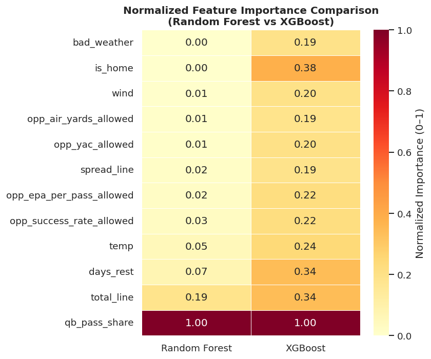

# Can Context Alone Predict a Quarterback's Passing Day?

## Hook: A New Approach Asks Whether Game Environment Matters More Than Recent Stats

Every week during the NFL season, analysts and fans alike ask the same question: how many yards will a quarterback throw for on Sunday? The instinctive answer is to look at what that quarterback did last week (and the week before that). But what if recent stats are the wrong thing to look at? What if the situation a quarterback is walking into matters more than the numbers he walked out with last time?

## Problem Statement: History-Based Predictions Leave a Blind Spot

The most common approach to projecting quarterback passing production relies on the quarterback's own recent statistics. Feed in last week's yardage totals, average them over a few games, and use that as your forecast. The problem is that this approach collapses when you need it most. For a quarterback returning from injury, a new starter with no track record, or a player who just changed teams. The historical record is thin or missing entirely, and the prediction falls apart.

There is a deeper issue, too. Raw yardage totals from past games do not tell you *why* a quarterback threw for a lot or a little. Was the defense weak? Was the game environment expected to be high-scoring? Was the offense trailing and forced to throw? The structural factors that drive passing volume before a single snap is taken are fully knowable before kickoff. The question this project set out to answer is whether those factors alone, without any historical yardage, can produce meaningful predictions.

## Solution Description: Pregame Context as the Entire Signal

This project built a custom dataset of 1,632 NFL quarterback-game observations spanning the 2020–2024 seasons and trained machine learning models to predict next-game passing yards using only structural pregame information. No historical yardage was used as a model input. Instead, the models were given:

- **Opponent pass-defense quality** — how well the opposing defense has been stopping the passing game in recent weeks, measured through EPA (Expected Points Added), success rate, air yards allowed, and yards after catch allowed
- **Betting market lines** — the pregame point spread and over/under total, which encode oddsmakers' collective expectations about game script and offensive volume
- **Usage share** — how much of the team's passing volume runs through the starting quarterback
- **Scheduling and weather context** — days of rest, home versus away, temperature, wind speed, and a bad-weather flag

Three models were trained and evaluated against a 2024 holdout season: Ridge Regression, Random Forest, and XGBoost. All three were compared against a mean baseline that simply predicts the same average yardage for every game.

## Results: Real Signal, Honest Limits

All three models beat the baseline. XGBoost was the best performer, reducing mean absolute error from **70.36 yards** (baseline) to **62.51 yards** — an 11% improvement. Ridge Regression and Random Forest performed nearly identically to each other at around 63 yards MAE.

| Model | MAE (yards) | R² |
|---|---|---|
| Baseline (train mean) | 70.36 | −0.000 |
| Ridge Regression | 62.95 | 0.188 |
| Random Forest | 62.96 | 0.190 |
| XGBoost | **62.51** | **0.223** |

The improvement is real but modest. The three non-baseline models all landed within half a yard of each other on MAE, which suggests the structural features are contributing consistent signal but also hitting a ceiling together, one that no single algorithm can push through on its own. An R² of 0.22 for XGBoost means the model explains about 22% of the variance in next-game passing yards, leaving 78% unexplained.

This makes sense. Quarterback passing yards are genuinely hard to predict. Even with the best possible information, the game involves injuries, in-game adjustments, turnovers, and individual performances that no pregame feature can anticipate. The models also deliberately exclude the quarterback's own recent yardage, which is one of the stronger autocorrelated signals. The 11% error reduction over the baseline is meaningful given those constraints, and the result confirms the core hypothesis: game context carries real predictive information that does not depend on how many yards the quarterback threw last week.

Further gains likely require richer data (tracking-based route metrics, coverage scheme tendencies, or real-time injury updates) instead of more modeling complexity applied to the same structural features.

## Chart Visualization

The chart below shows which pregame features each model weighted most heavily when making predictions.

The single most important feature across both models is **`qb_pass_share`**, which represents the share of team pass attempts that run through the starting quarterback. This captures usage role: quarterbacks who handle all of their team's throwing volume naturally accumulate more yards, and this number is knowable before the game. Both models scored it at 1.00 normalized importance, making it the dominant signal in the feature set.

Beyond usage, the two models diverge in what they weigh next. Random Forest assigned the most weight after `qb_pass_share` to `total_line` at 0.19 (the over/under betting total, which captures expected offensive volume) and `days_rest` at 0.07. XGBoost spread its attention more evenly, giving meaningful weight to `is_home` (0.38), `days_rest` (0.34), `total_line` (0.34), `temp` (0.24), and the opponent defense metrics (0.19–0.22). The agreement on `qb_pass_share` and `total_line` as top-tier features is striking: both are pure pregame knowables with no dependence on the quarterback's individual history. The disagreement on `is_home` and `days_rest` suggests that scheduling context adds incremental signal for the gradient-boosted model that the shallower forest cannot capture as efficiently.

Notably, the opponent air yards and weather-specific features (`bad_weather`, `wind`, `opp_air_yards_allowed`) landed at the bottom of both models' rankings. This does not mean they are unimportant in the real world (bad weather demonstrably suppresses passing) but it suggests their effect may be captured indirectly by the market lines, or that the binary `bad_weather` flag is too coarse to isolate their contribution at the game level.

The overall picture is a model that works from context up: knowing how much a team throws, whether the market expects a high-scoring game, and how the opponent's defense has been performing recently is enough to make a forecast that meaningfully improves on guessing the average. That is a useful result and a promising foundation for a richer model that adds tracking data, injury context, and deeper defensive tendencies to the same structural backbone.
